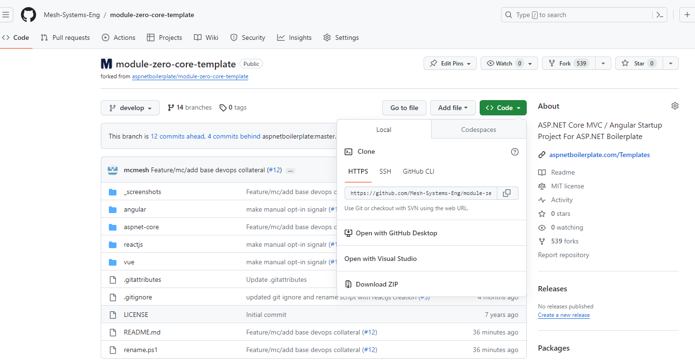
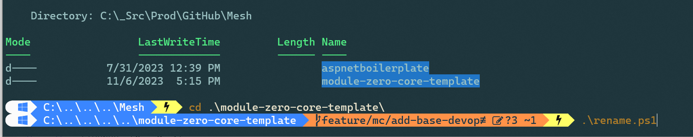
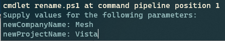
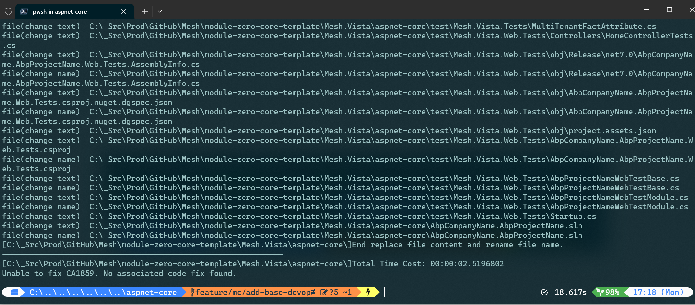
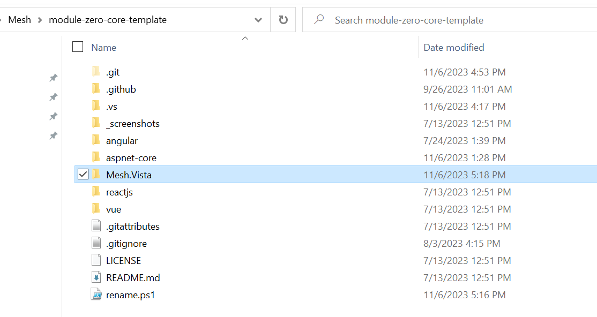
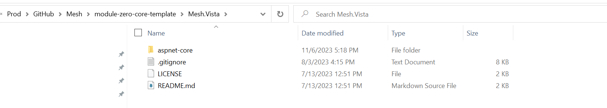
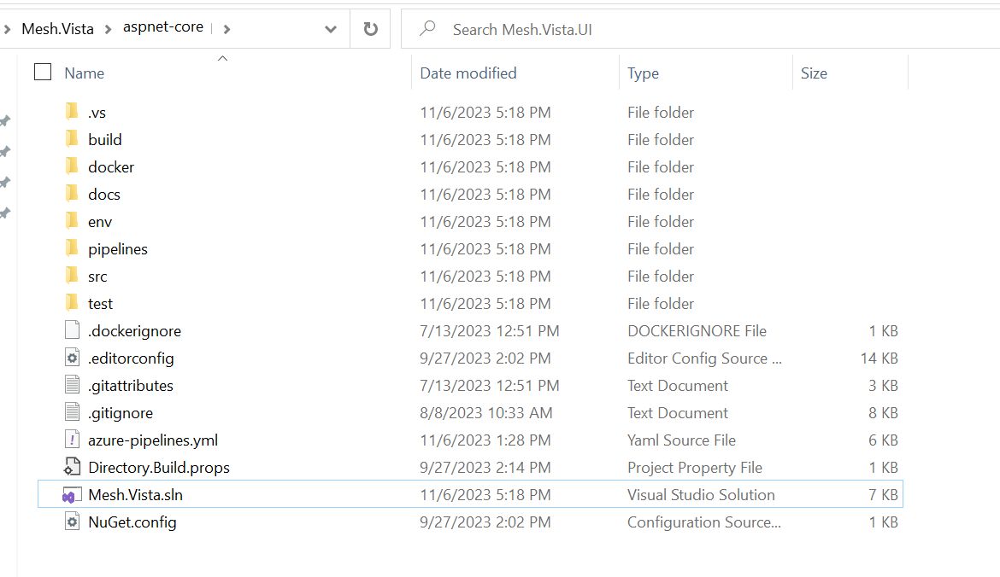
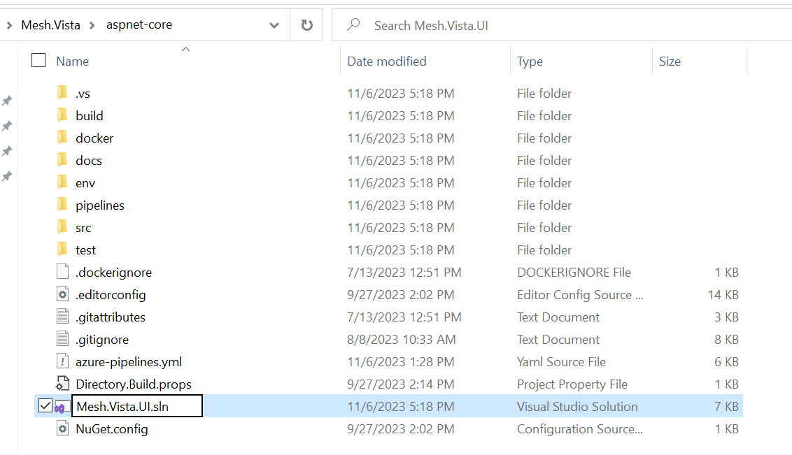
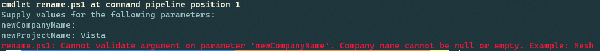
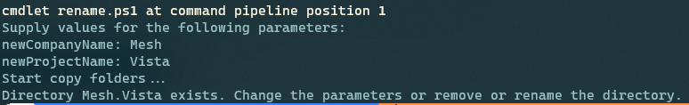

# Important

Issues of this forked repository's parent are tracked on https://github.com/aspnetboilerplate/aspnetboilerplate.

**NOTE:** If there are issues, please reach out to the Mesh Team.

# Introduction

This is a template to create **ASP.NET Core MVC / Angular** based startup projects for [ASP.NET Boilerplate](https://aspnetboilerplate.com/Pages/Documents). It has two different versions:

1. [ASP.NET Core MVC & jQuery](https://aspnetboilerplate.com/Pages/Documents/Zero/Startup-Template-Core) (server rendered multi-page application).
2. [ASP.NET Core & Angular](https://aspnetboilerplate.com/Pages/Documents/Zero/Startup-Template-Angular) (single page application).
 
User Interface is based on [AdminLTE theme](https://github.com/ColorlibHQ/AdminLTE).

### NOTE: The primary focus has been on the ASP.NET Core MVC version. It includes DevOps components that allow for rapid deployment when expected shared Azure resources are available. The Mesh version includes React and Vue templates based on an older version of the boilerplate. These versions are outdated and should be used with caution as several dependencies are outdated.

# Mesh Specific Implementation
Clone [Mesh's Fork of the Boilerplate Repository.](https://github.com/Mesh-Systems-Eng/module-zero-core-template)

#### From the root of the repo, execute the rename.ps1 file:

#### Enter the name of the Company and Project:

#### Result after the script executes:

#### A folder based on the given Company and Project will be created:

#### Navigate into the folder just created. The structure will resemble the following:

#### Navigate into the aspnet-core folder. The structure will resemble the following:
##### Note: For MVC apps, this is the Solution folder.

#### Rename the .sln file to reflect the name of the repo:

#### Move all of the contents of the folder to the targeted customer repository.

#### Remove the generated folder from the boilerplate repo.

#### Follow the steps in the README.md in the targeted customer repository to configure DevOps for the new UI solution.

### Possible Issues:
#### Empty params will result the script ending without creating the project:

#### Entering the same params with a previous exiting directing with the same name will result the script ending:

# Screenshots

#### Sample Dashboard Page

#### User Creation Modal

#### Login Page

# Documentation

* [ASP.NET Core MVC & jQuery version.](https://aspnetboilerplate.com/Pages/Documents/Zero/Startup-Template-Core)
* [ASP.NET Core & Angular  version.](https://aspnetboilerplate.com/Pages/Documents/Zero/Startup-Template-Angular)

# License

[MIT](LICENSE).
