# Introduction

This is a template to create **ASP.NET Core MVC / Angular** based startup projects for [ASP.NET Boilerplate](https://aspnetboilerplate.com/Pages/Documents). It has two different versions:

1. [ASP.NET Core MVC & jQuery](https://aspnetboilerplate.com/Pages/Documents/Zero/Startup-Template-Core) (server rendered multi-page application).
2. [ASP.NET Core & Angular](https://aspnetboilerplate.com/Pages/Documents/Zero/Startup-Template-Angular) (single page application).
 
User Interface is based on [AdminLTE theme](https://github.com/ColorlibHQ/AdminLTE).

Mesh's Codebase has been forked and is available [here.](https://github.com/Mesh-Systems-Eng/module-zero-core-template)

### NOTE: Mesh's primary focus has been on the ASP.NET Core MVC version. It includes DevOps components that allow for rapid deployment when expected shared Azure resources are available. The Mesh version includes React and Vue templates based on an older version of the boilerplate. These versions are outdated and should be used with caution as several dependencies are outdated. The Angular version is also outdated and should be used with caution due to dependencies.

# Mesh Running Locally
#### Open the solution in Visual Studio. 
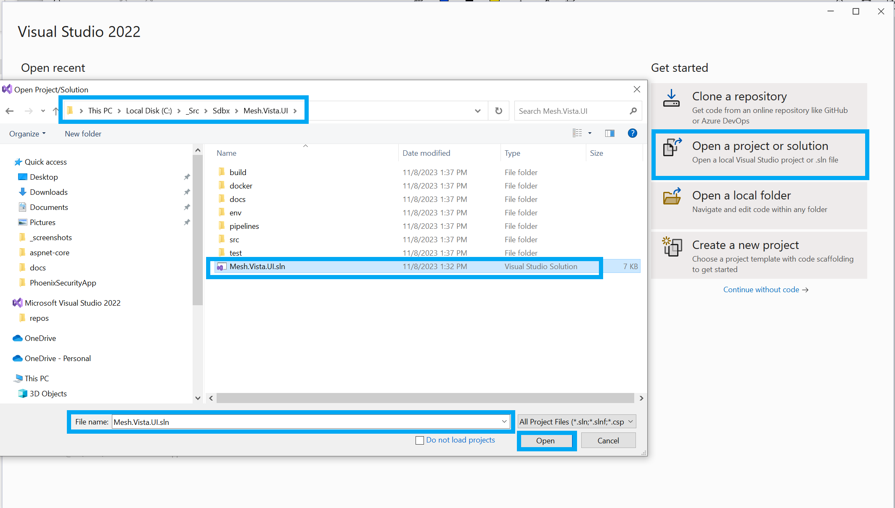

#### Edit the appsettings.json located in the /src/Company.Project.Web.Mvc project and update connection string to the appropriate SQL Server. The given credentials need entity creation DML. **(If there is no existing database, the given credentials need database creation DML.)**
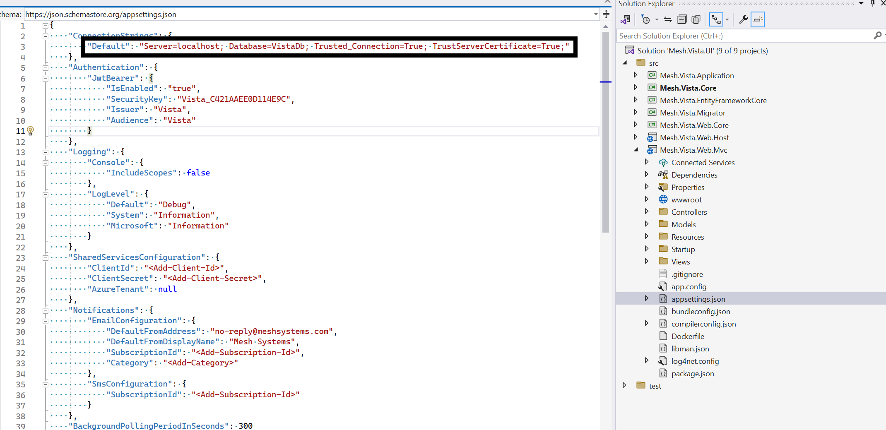

#### Edit Authorization/Users/User.cs located in the /src/Company.Project.Core project and change the default password.
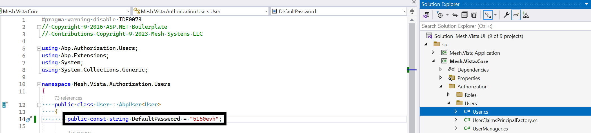

#### Edit Web/WebContentFolderHelper.cs located in the /src/Company.Project.Core project and change the solution name to match the current solution.
#### Before
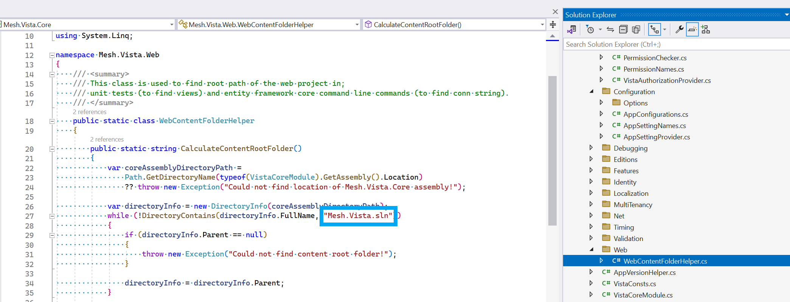
#### After
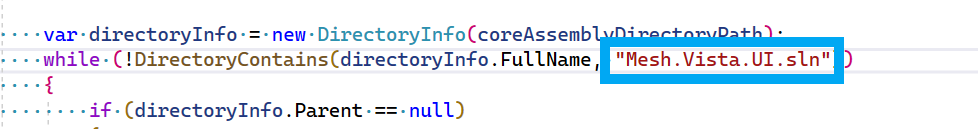

#### To build out and seeds the database.
#### 1) Select the Company.Project.Web.Mvc project as the target to run with IIS Express. (Top of Visual Studio in the image.)
#### 2) In the Package Manager Console, select src\Company.Project.EntityFrameworkCore as the project.
#### 3) Execute Update-Database. (Bottom of Visual Studio in the image.)
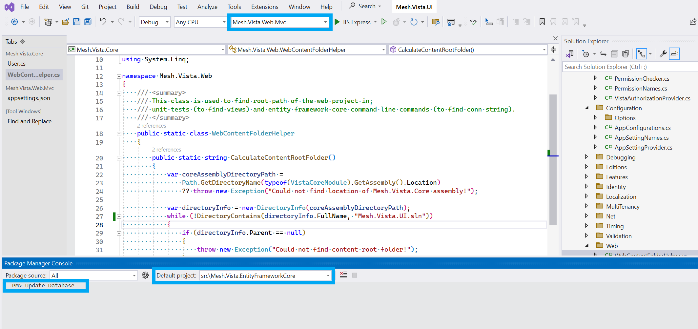

#### Right-click on the libman.json file located in the Company.Project.Web.Mvc project and select _Restore Client-Side Libraries._
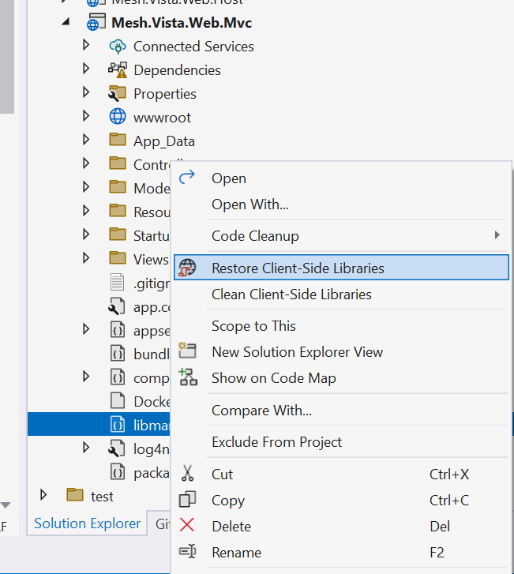

# Mesh DevOps

#### Several assumptions have been made to what is Azure Resources are already available and referenced in the deployment:

- Application Insights
- Key Vault
- Resource Group
- SQL Server
- Storage Account

#### If those are not available, they will need created or the /env/modules/app.bicep will need modified.

#### The Default DB Connection String is expected to be in Key Vault when running in Azure. To run locally prior to this, the appsettings.json in the MVC projects folder can be adjusted to point to the targeted database.

#### Additionally, an Azure DevOps service principle is required. It can be created or located here:
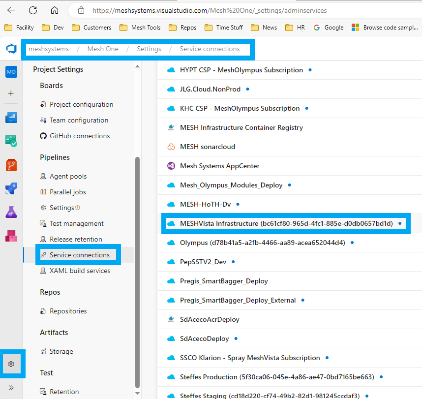

#### Navigate to the /pipelines folder and open the variables.yml file.
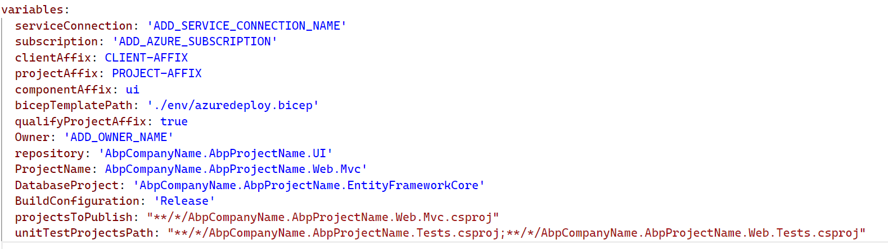

#### Edit the variables.yml file and fill in the following items: (Consult with DevOps if there is a question regarding the values.)
##### (Can be found in the existing resource group. * )
- ADD_SERVICE_CONNECTION_NAME *
- ADD_AZURE_SUBSCRIPTION *
- CLIENT-AFFIX *
- PROJECT-AFFIX *
- COMPONENT-AFFIX (Usually defaulted to **ui** for this type of project)
- ADD_OWNER_NAME (Usually the TP or Tech Lead)
- AbpCompanyName (In the example: Mesh)
- AbpProjectName (In the example: Vista)

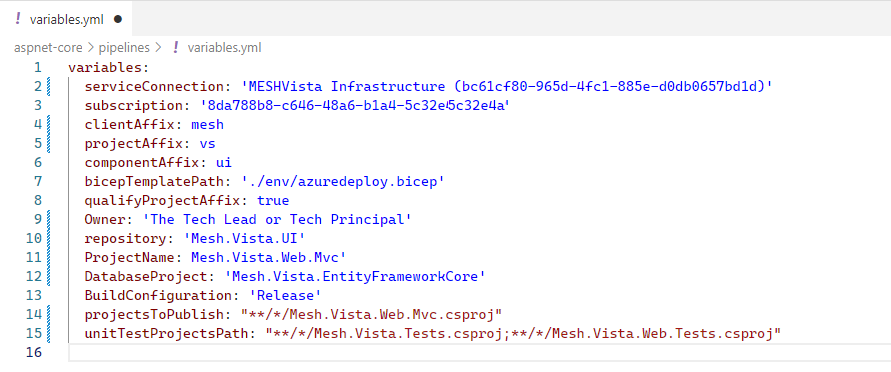

#### For deployment, an Azure DevOps Variable Group is also required for all environments (Dv, Sg, Pd, Etc.)
#### The format is based on: Client-Affix + _ + Project-Affix + _ + Component-Affix + _ + Environment

#### Required Variables include
- resourceGroup
- resourceGroupLocation

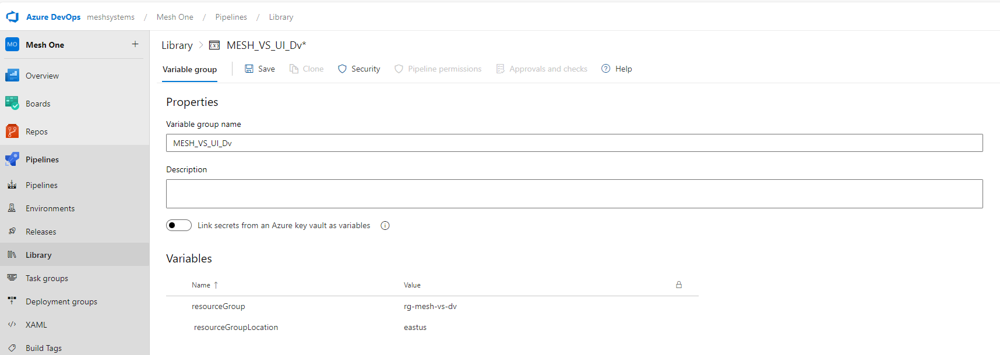
