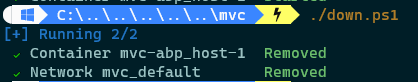

# Running Locally On Docker

The startup template includes necessary files for building Docker images and running those as containers in Docker.

## Building Docker images
To build a Docker image, open a PowerShell terminal and navigate to the /build folder. Run the build-mvc.ps1 script.

 This script will build an abp/mvc Docker image. The image can be used with a remote or local SQL Server. If using a remote instance and the value in the appsettings.json has the remote connection string, no other configuration is needed.

 If using a local instance, configuration instructions are given in the /docker/mvc/up.ps1 script.

The configuration section needs uncommented. An attempt will be made to acquire the local IP address and use it for connectivity. Update the Port (if not 1433), DB User and Password and save.

Additionally, docker-compose.yml will need updated as well.

Uncomment the ConnectionStrings__Default variable and save.

## Running the project

After the Docker image has been created, open a PowerShell terminal, and navigate to the /docker/mvc folder. Run the up.ps1 script to run the Docker image.

The application can be access in the browser with: http://localhost:44312

To stop the container, in the /docker/mvc folder, run the down.ps1 script.

